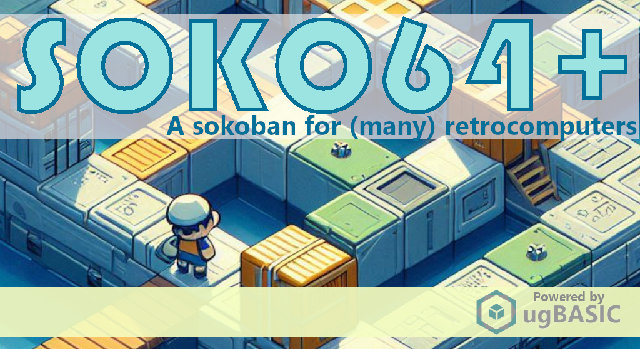

# SOKO64+
A sokoban for (many) retrocomputers

Sokoban is a famous puzzle game designed in 1981 by Hiroyuki Imabayashi, and first published in December 1982. You have to place all crates over the targets, by pushing them. 

**[SOKO64](https://triqui.itch.io/soko64)** is the original version written by [Emanuele Feronato](https://www.emanueleferonato.com/) in [ugBASIC](https://ugbasic.iwashere.eu) and it was developed for the Commodore 64 target (`c64`). It includes **64 8x8 tricky levels** by David Skinner. All levels are unlocked from the beginning, for you to try them all. Solved levels will be marked with green.

**[SOKO64+](https://spotlessmin.itch.io/soko64plus)** is a new version of the same game by Marco Spedaletti: starting from that source code , in order to run on many ugBASIC's targets, with just **a single source code**.

[Click here](https://spotlessmin.itch.io/soko64plus) to download the executables for the various home computers:
  * **AMSTRAD CPC 664** [DSK format] ([more info](docs/instructions-cpc.md))
  * **ATARI 400/800** [XEX or ATR format] ([more info](docs/instructions-atari.md))
  * **ATARI XL/XEGS** [XEX or ATR format] ([more info](docs/instructions-atarixl.md))
  * **COLECOVISION** [ROM format] ([more info](docs/instructions-coleco.md))
  * **COMMODORE 128** [PRG and D64 format] ([more info](docs/instructions-c128.md))
  * **COMMODORE 64** [PRG and D64 format] ([more info](docs/instructions-c64.md))
  * **DRAGON 32** [BIN format] ([more info](docs/instructions-d32.md))
  * **DRAGON 64** [BIN format] ([more info](docs/instructions-d64.md))
  * **MSX** [ROM and DSK format] ([more info](docs/instructions-msx1.md))
  * **OLIVETTI PRODEST PC128** [K7 format] ([more info](docs/instructions-pc128op.md))
  * **SEGA SG-1000** [ROM format] ([more info](docs/instructions-sg1000.md))
  * **THOMSON MO5** [K7 format] ([more info](docs/instructions-mo5.md))
  * **THOMSON TO8** [K7 format] ([more info](docs/instructions-to8.md))
  * **TRS-80 COLOR COMPUTER 1/2** [BIN format] ([more info](docs/instructions-coco.md))
  * **TRS-80 COLOR COMPUTER 3** [BIN and DSK format] ([more info](docs/instructions-coco3.md))
  * **ZX SPECTRUM 48K** [BIN and DSK format] ([more info](docs/instructions-zx.md))

In addition to downloading the already compiled binaries, it is obviously possible to recompile the game using **[ugBASIC](https://ugbasic.iwashere.eu)** or directly the **[UGBASIC-IDE](https://spotlessmind1975.itch.io/soko64plus)**. The game can currently be compiled with the **[beta](https://ugbasic.iwashere.eu/changelog/beta)** version of the compiler.

## LICENSE

Original **SOKO64** source for Commodore 64 by Emanuele Feronato, and **SOKO64+** has been ported to other platforms by Marco Spedaletti.

Official binary distribution of **SOKO64** at:
https://triqui.itch.io/soko64

Official binary distribution of **SOKO64+** at:
https://spotlessmind1975.itch.io/soko64plus

**SOKO64+** is licensed under the Apache License, Version 2.0 (the "License");
you may not use this file except in compliance with the License.
You may obtain a copy of the License at

http://www.apache.org/licenses/LICENSE-2.0

Unless required by applicable law or agreed to in writing, software distributed under the License is distributed on an "AS IS" BASIS, WITHOUT WARRANTIES OR CONDITIONS OF ANY KIND, either express or implied. See the License for the specific language governing permissions and limitations under the License.

