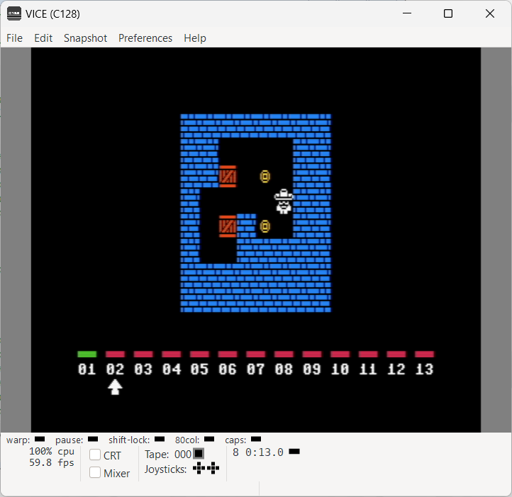

# INSTRUCTIONS

## COMMODORE 128 (MOS 8502)

In order to play this game on a **COMMODORE 128**, you need this home computer or to download and install an emulator. The game has been tried on *VICE version 3.8* .

*VICE* is a program that runs on a Unix, MS-DOS, Win32, OS/2, BeOS, QNX 4.x, QNX 6.x, Amiga, Syllable or Mac OS X machine and executes programs intended for the old 8-bit computers. The current version emulates the C64, the C64DTV, the C128, the VIC20, practically all PET models, the PLUS4 and the CBM-II (aka C610/C510). An extra emulator is provided for C64 expanded with the CMD SuperCPU

The emulator can be downloaded [here](https://vice-emu.sourceforge.io/).

### Loading instructions (PRG file / D64 image)

Once the emulator software has been installed, follow the instructions below:
 - start **x128.exe** program;
 - click on **File** > **Smart attach...**
 - select <code>soko64plus.c128.prg</code> file ([click here to download](https://spotlessmind1975.itch.io/soko64plus)) or <code>soko64plus.c128.d64</code> file ([click here to download](https://spotlessmind1975.itch.io/soko64plus));
 - click on **Open**.

Alternatively, you can directly perform the command line game, indicating the file as a parameter of the emulator, so you can type:
 - <code>x128.exe soko64plus.c128.prg</code>
 - <code>x128.exe soko64plus.c128.d64</code>