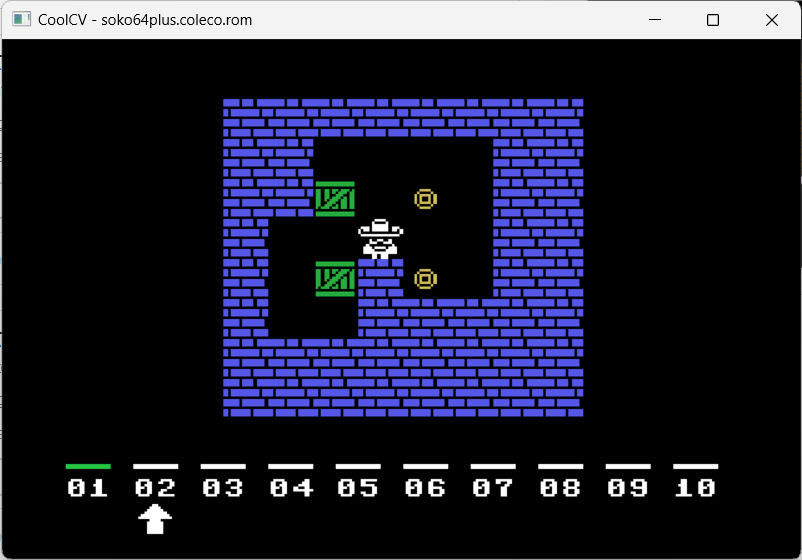

# INSTRUCTIONS

## COLECOVISION

In order to play this game on a **ColecoVision** you need this console or to download and install an emulator. The game has been tried on *BlueMSX*.

*blueMSX* is a portable, open-source MSX, Sega SG-1000, SC-3000, SF-7000 and ColecoVision emulator available for Windows and other platforms as a libretro core.

The emulator can be downloaded [here](http://bluemsx.msxblue.com/download.html).

### Loading instructions

Once the emulator software has been installed, follow the instructions below:
 - start **bluemsx.exe** program;
 - click on **Insert ROM slot 1** button;
 - select <code>soko64plus.coleco.rom</code> file ([click here to download](https://spotlessmind1975.itch.io/soko64plus));
 - make sure you have enabled the joystick configured.

