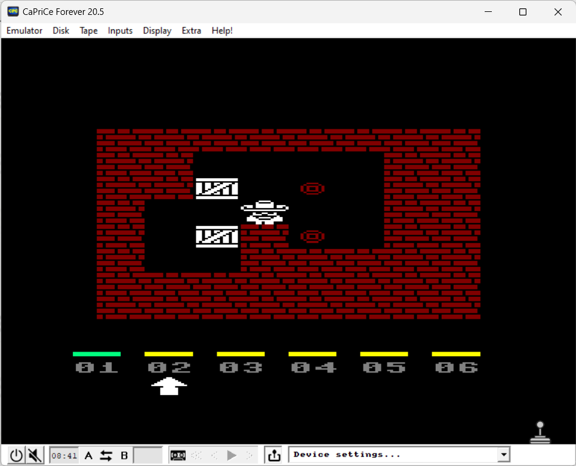

# INSTRUCTIONS

## AMSTRAD CPC 664

In order to play this game on an **Amstrad CPC 664** you need this home computer or to download and install an emulator. The game has been tried on *CaPriCe Forever version 20.5.0.0* .

*CaPriCe Forever* is an emulator for Amstrad CPC 464, 664 and 6128 computers running Windows. This is the latest evolution of a portage started in 2006 of the emulator "Caprice32", written by Ulrich Doewich.

The emulator can be downloaded [here](https://emutopia.com/index.php/emulators/item/311-amstrad-cpc/1762-caprice-forever).

### Loading instructions

Once the emulator software has been installed, follow the instructions below:
 - start **caprice.exe** program;
 - click on **Disk** > **Load image on Drive A...**
 - select <code>soko64plus.cpc.dsk</code> file ([click here to download](https://spotlessmind1975.itch.io/soko64plus));
 - click on **Open**;
 - type <code>RUN"MAIN</code>;
 - make sure you have enabled the joystick with keyboard option.

