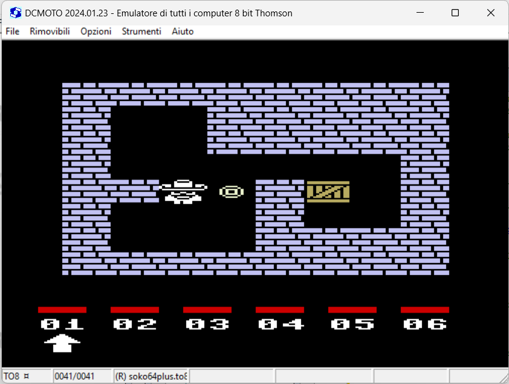

# INSTRUCTIONS

## THOMSON TO8

In order to play this game on an **Thomson TO8** you need this home computer or to download and install an emulator. The game has been tested on *DCMOTO version 2024.01.23* .

*DCMOTO* is a Thomson 8 bit computer emulator for Windows. It emulates the Thomson MO5, MO6, T9000, TO7, TO8, TO9, and the Olivetti Prodest PC128 series of computers. 

The emulator can be downloaded [here](http://dcmoto.free.fr/emulateur/index.html).

### Loading instructions

Once the emulator software has been installed, follow the instructions below:
 - start **dcmoto.exe** program;
 - click on **Options**;
 - select **TO8**;
 - click on **Ok**;
 - click on **Removables**;
 - click on **Load...** next to "K7" drawer;
 - select <code>soko64plus.to8.k7</code> file ([click here to download](https://spotlessmind1975.itch.io/soko64plus));
 - click on **Open**;
 - type <code>LOADM"CASS:",,R</code>.
