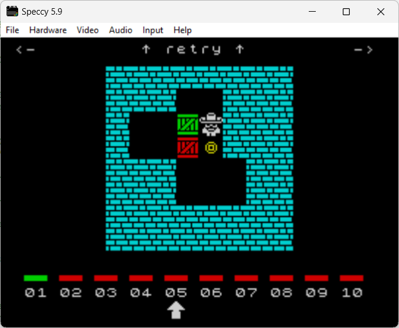

# INSTRUCTIONS

## ZX SPECTRUM 48K

In order to play this game on a **ZX Spectrum 48K** you need this home computer or to download and install an emulator. The game has been tried on *Speccy*.

*Speccy* emulates 16kB, 48kB, and 128kB versions of Sinclair ZX Spectrum, as well as Spectrum +2, +2A, and +3, as well as Timex Sinclair models.

The emulator can be downloaded [here](https://fms.komkon.org/Speccy/).

### Loading instructions

Once the emulator software has been installed, start **speccy** program with the following command line: 
 
<code>speccy soko64plus.zx.tap</code>.

